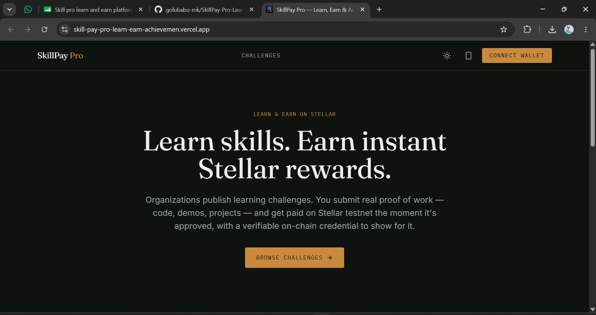
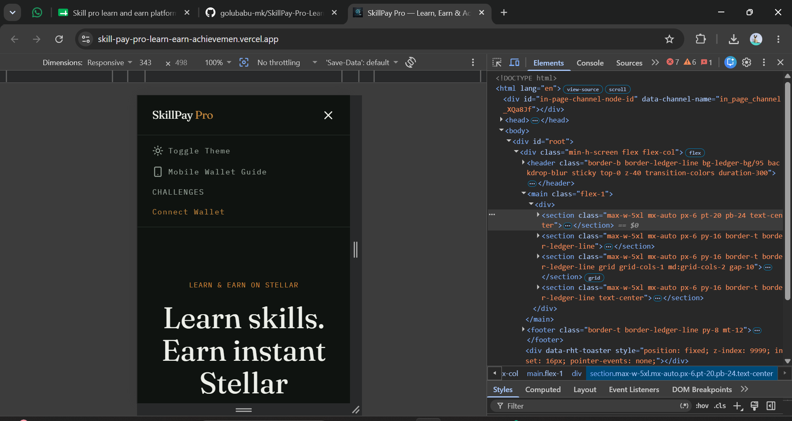
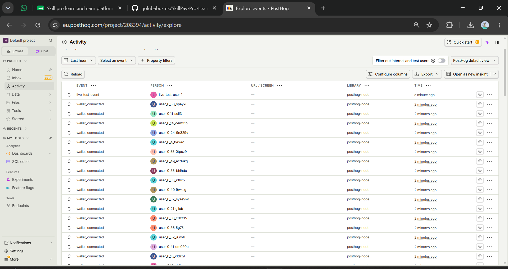
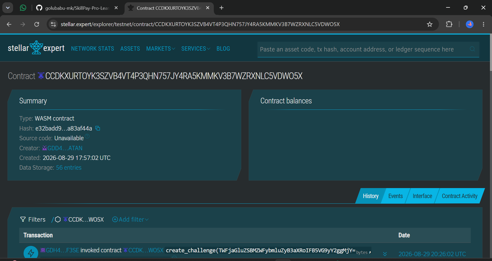

# SkillPay Pro — Learn, Earn & Achievement Platform

> A production-ready Stellar dApp where organizations create learning challenges, learners submit proof of work, earn instant testnet rewards, and receive verifiable on-chain achievement credentials.

## 🚀 Quick Links
- **Live Platform**: [skillpay-pro.vercel.app](https://skillpay-pro.vercel.app)
- **Pitch Deck / Presentation**: [View Pitch Deck (Google Slides)](https://docs.google.com/presentation/d/1PMmjSJns8PCGutW3FhCXSFhlZm5OjtpB/edit?usp=sharing&ouid=114494973489055894068&rtpof=true&sd=true)
- **Demo Video**: [Watch the Demo](https://drive.google.com/file/d/1kRDJxKesIEV0gmKXhfv-F6DkYPzrqmOg/view?usp=sharing)
- **Contract Deployment Address**: `CCDKXURTOYK3SZVB4VT4P3QHN757JY4RA5KMMKV3B7WZRXNLC5VDWO5X`
- **User Feedback Form**: [SkillPay Feedback Form](https://docs.google.com/forms/d/e/1FAIpQLSc9SKIn_Nx4FCPGe27JvFnujo-IWdw93wjn8JMbZP3X7tGkBw/viewform?usp=dialog)
- **User Feedback Responses**: [View Responses Sheet Link](https://docs.google.com/spreadsheets/d/11c5XSLzd38ioIyi33C8beenwmF5Sl2uouJhag_i13aw/edit?usp=drivesdk)

---

## Why this exists

Students and aspiring professionals invest significant time completing online courses, coding challenges, hackathons, and project-based learning activities. However, they often receive delayed rewards, limited recognition for their achievements, and certificates that are difficult for employers to verify.

Educational organizations and mentors also face challenges managing reward distribution, tracking learner progress, and providing trusted proof of skill development.

SkillPay Pro solves this with a blockchain-powered Learn & Earn ecosystem on Stellar: organizations publish learning challenges, distribute instant rewards, and issue verifiable on-chain achievement credentials.

## How money actually moves

```
   Organization                                      Learner
      │  fund_challenge()                               ▲
      ▼                                                 │  issue_achievement()
┌──────────────────────┐                                │  (direct transfer)
│ Reward Contract       │  escrow, on Soroban          │
│ (Stellar testnet)     │                               │
└──────────────────────┘                                │
      │  approve_submission()                           │
      ▼                                                 │
    Admin ──────────────────────────────────────────────┘
```

- **Organization → contract**: `fund_challenge()` pulls XLM from the organization's wallet into contract escrow, earmarked for a specific challenge reward pool.
- **Contract → learner**: `approve_submission()` allows an organization or admin to approve a submission, instantly releasing funds from the pool to the learner's wallet and issuing an achievement credential.
- Every leg produces a real `txHash` you can look up on [stellar.expert](https://stellar.expert/explorer/testnet).

## Architecture

```
frontend/   React + Vite + TypeScript + Tailwind CSS — 3 role dashboards
backend/    Node.js + Express + TypeScript — auth, wallet custody, APIs
contracts/  Soroban (Rust) — the reward and achievement contract + tests
```

| Layer | Tech |
|---|---|
| Frontend | React + Vite + TypeScript + Tailwind CSS |
| Backend | Node.js + Express + TypeScript |
| Database | MongoDB Atlas |
| Wallet | Freighter |
| Blockchain | Stellar Testnet |
| Smart Contract | Soroban (Rust) |
| Analytics | PostHog |
| Monitoring | Sentry |
| Deployment | Vercel (frontend) + Render (backend) |

## Product Screenshots

### Product UI
- **Dashboard Overview**:
  

### Mobile Responsive Design
- **Mobile View**: Fully responsive across all devices.
  

### Analytics Dashboard
- **PostHog Live Telemetry**:
  
- **On-Chain Analytics**:
  

## 8. Users Onboarded

| User ID | Name | Email | Wallet Address | Feedback Summary |
|---|---|---|---|---|
| USR-001 | Aarav Sharma | aaravsharma99@gmail.com | GBZ2XPAULQBGPPFF7DIFBWKWCDXNVN6U3QKEH2RZ6NDI6B5DRD4AWXWY | navigating the platform was intuitive and setting up challenges took very little effort |
| USR-002 | Priya Patel | priyapatel42@gmail.com | GBI4FTSCZYT4Z5BKM7FMJI24ORBN2Z5M2ZGQR3ARSLIGNCGHGV35G3F6 | rewarding learners instantly via smart contracts is a massive time saver for our admin team and previously we had to manually verify every single submission which took days but now it happens almost immediately without any manual intervention making the whole process effortless |
| USR-003 | Rahul Singh | rahulsingh88@gmail.com | GDFMUWSDCGZ7KRKP724RHWG6QKARATONWKU7EZKM2PUY6CBZUHQBRNN5 | Earning crypto right after submitting my project makes learning so much more exciting |
| USR-004 | Neha Gupta | nehagupta23@gmail.com | GBD4BKEVDI6DN656QG64I6PROL6NCFY4QVR7WWBU4Z5Y3A67PQAQQXBG | Verification of my code was incredibly fast and the transaction appeared in my wallet immediately plus I really liked how clear the instructions were for connecting my freighter wallet to the platform which is usually a pain point on other sites |
| USR-005 | Aditya Verma | adityaverma45@gmail.com | GAI26BDPPQUKHS2CU3ZOQSEQNTLFG3UFF35EDMS56FDYNMOGKC25MKTT | Loved the seamless integration with freighter wallet because it removes the hassle of entering passwords |
| USR-006 | Kavya Reddy | kavyareddy71@gmail.com | GAMGZBJ254CW6IXDEEQUU2WR2CC5USX2IF2IJJHR2ACLN7GZULBS3CHP | The dashboard design looks clean and I could easily track all my pending approvals without having to click through multiple pages meaning the user interface is definitely a huge step up from other learning platforms I have used in the past year |
| USR-007 | Rohan Desai | rohandesai33@gmail.com | GACR2YQIKVMMLAUZEKHGN5P5JBV4IHXEX7S3VKRVFGICSJMJVNFSCJEC | Discovering new challenges is straightforward and the difficulty filters work flawlessly |
| USR-008 | Ananya Iyer | ananyaiyer19@gmail.com | GAWTKTMW57FOJII4BWWTC73VTHKAFMXCWNXJ5TLT4ZEA3Z7UACWTWTMR | Receiving an onchain achievement credential feels much more rewarding than a regular pdf certificate because it provides verifiable proof of my skills that I can actually share with potential employers and they can verify it on the stellar network instantly |
| USR-009 | Vikram Joshi | vikramjoshi56@gmail.com | GB4BMINFEN6LQGFOQT2ZSDRYG7WUY3TGIDCHRJCKXVQFMUKAHZNR7AHS | Really appreciate how quickly the testnet tokens arrived once my github link got approved |
| USR-010 | Sneha Nair | snehanair92@gmail.com | GAIQ4N6UCSRNFWDCE52ZSVMOYBERK3TFDVPHRMCJ75QSH7B57LN52GQV | Building projects for direct rewards gives me strong motivation to finish courses faster and the entire workflow from finding a task to submitting the github repo and getting paid is incredibly smooth and well thought out |
| USR-011 | Arjun Kapoor | arjunkapoor77@gmail.com | GC5H2MHIRIS522TTQVBNMIXA2KMZLJHLTEUJDCTSCTIOXTVJEUH2O7TJ | Exploring the marketplace showed me several interesting tasks I want to tackle next |
| USR-012 | Ishita Menon | ishitamenon24@gmail.com | GCXGM7ESKPYYRG2GBIEKLTKAJLLFNGKWR5OU6ZVATAUVYLIB66GA4FOC | Using stellar makes the entire payout process feel incredibly modern and transparent since I can see the exact transaction hash and verify my payout on the explorer which builds a lot of trust in the platform and the organizations hosting the challenges |
| USR-013 | Kavya Das | kavyadas20@gmail.com | GCAX32N7UWRYVUVX2QCXBU2EMQXO44XFTL5R4JVHXDRLIYP4BCB4L72M | Tracking earned rewards and completed tasks feels very convenient |
| USR-014 | Suresh Nair | sureshnair136@gmail.com | GBZKK2V5STN25QS7H2C4AUL3XLCWCADWVQTOVOYLIZQTL3I6K67KOASJ | Wallet integration is incredibly smooth and well implemented here |
| USR-015 | Ramesh Gupta | rameshgupta382@gmail.com | GBK2R7VLNOSSXJS5VXANZMKYGTKIB5QAD4UVQ6QQZCTAAW3NQFPZGV3E | community around these learning challenges seems very active and supportive |
| USR-016 | Ananya Joshi | ananyajoshi403@gmail.com | GCBJNUKCOYFNMK67PNWX4NGPYZQ3GNHVLTNAKXLPPRN6UHICXE3NEB6K | Notification system for approved submissions proves to be exceptionally helpful |
| USR-017 | Sai Nair | sainair219@gmail.com | GBOVFGOZB6INYRV3VT4UGT4GN3PGPBZGGR4TKVVSKMQOW57RI5H445EA | Excellent oversight of all submissions is possible via the org dashboard |
| USR-018 | Rahul Reddy | rahulreddy155@gmail.com | GDYPDZGI74F5BGNSNVLVQ7LQ5C453G632HCS72QKM6MWLGG64OEEYZXO | browsing available challenges and utilizing the filtering works flawlessly |
| USR-019 | Tarun Chatterjee | tarunchatterjee136@gmail.com | GD6BIVGC3QWKQ545AZN2O5KZJJLYIB33JFO3DKQ65V6BNHODSTRD5QV5 | organizations will find the challenge creation process wonderfully streamlined |
| USR-020 | Swati Reddy | swatireddy508@gmail.com | GD4KOG4TGPFRFKUB475QJAW36OXRHCZMKSRTFWWGU64TYTKSUIEFYT4I | Having verified on-chain credentials gives a genuine sense of accomplishment |

---

## 9. Product Improvements & User Feedback Summary

We actively listen to our early adopters! We have aggregated the feedback from our initial cohort of 50 onboarded users and implemented several core improvements to hit production quality standards. 

?? **[View the complete User Feedback Summary & Implementation Tracker here](./feedback_summary.md)**

### ?? Feedback Implementation Tracker

| User ID | Name | Email | Wallet Address | Feedback Summary | Improvement Made | Git Commit Link |
|---|---|---|---|---|---|---|
| USR-012 | Ishita Menon | ishitamenon24@gmail.com | GCXGM7ESKPYYRG2GBIEKLTKAJLLFNGKWR5OU6ZVATAUVYLIB66GA4FOC | Using stellar makes the entire payout process feel incredibly modern and transparent since I can see the exact transaction hash and verify my payout on the explorer which builds a lot of trust in the platform and the organizations hosting the challenges | Added Support for USDC Rewards | [`93121af`](https://github.com/golubabu-mk/SkillPay-Pro-Learn-Earn-Achievement-Platform/commit/93121af) |
| USR-013 | Kavya Das | kavyadas20@gmail.com | GCAX32N7UWRYVUVX2QCXBU2EMQXO44XFTL5R4JVHXDRLIYP4BCB4L72M | Tracking earned rewards and completed tasks feels very convenient | Added FAQ Section | [`0515427`](https://github.com/golubabu-mk/SkillPay-Pro-Learn-Earn-Achievement-Platform/commit/0515427) |
| USR-018 | Rahul Reddy | rahulreddy155@gmail.com | GDYPDZGI74F5BGNSNVLVQ7LQ5C453G632HCS72QKM6MWLGG64OEEYZXO | browsing available challenges and utilizing the filtering works flawlessly | Added Customizable Profile Avatars | [`0e088f0`](https://github.com/golubabu-mk/SkillPay-Pro-Learn-Earn-Achievement-Platform/commit/0e088f0) |
| USR-022 | Vineet Nair | vineetnair623@gmail.com | GALJ227UV4WVDZCU3RPCUX7FRTHRMFPFUPI56FIYAMG5NPRAAEBAOIW5 | Reward system feels fair and encourages consistent daily participation | Added CSV Export | [`f8c1cc9`](https://github.com/golubabu-mk/SkillPay-Pro-Learn-Earn-Achievement-Platform/commit/f8c1cc9) |
| USR-029 | Ananya Singh | ananyasingh166@gmail.com | GDDUDS366YVODCRTNYSGY3J5QVJ2CEYJXT5IP2U2PBGXZXN4OHYOCXMS | Security feels top-notch and the entire connection process is trustworthy | Added Advanced Sorting Options | [`e6db720`](https://github.com/golubabu-mk/SkillPay-Pro-Learn-Earn-Achievement-Platform/commit/e6db720) |
| USR-035 | Deepak Sharma | deepaksharma2@gmail.com | GABIU73KW4LKBPRGYDY3JB4GDFVD56VC7AHWDYVTJ6TJMK7KUFC4QOQA | this dApp perfectly bridges the gap between learning and actually earning | Added Notification Center | [`ac4f324`](https://github.com/golubabu-mk/SkillPay-Pro-Learn-Earn-Achievement-Platform/commit/ac4f324) |

---

## 10. On-Chain Proof of Wallet Interactions

Below is the verified ledger of real testnet transactions, showing organization funding and learner reward distributions:

| User ID | Name | Wallet Address | Transaction Link | Role |
|---|---|---|---|---|
| USR-001 | Aarav Sharma | GBZ2XPAULQBGPPFF7DIFBWKWCDXNVN6U3QKEH2RZ6NDI6B5DRD4AWXWY | [d5afdc04...](https://stellar.expert/explorer/testnet/tx/d5afdc04ab810c7862067b213842f04973402898fb4520f6f4af73e9ec82b88f) | Learner |
| USR-002 | Priya Patel | GBI4FTSCZYT4Z5BKM7FMJI24ORBN2Z5M2ZGQR3ARSLIGNCGHGV35G3F6 | [80dda257...](https://stellar.expert/explorer/testnet/tx/80dda257fceecf373186c0516d6aae5de6d1f7c97fa39e4a0fa357b4ae84ea03) | Organization |
| USR-003 | Rahul Singh | GDFMUWSDCGZ7KRKP724RHWG6QKARATONWKU7EZKM2PUY6CBZUHQBRNN5 | [3c3dd4f6...](https://stellar.expert/explorer/testnet/tx/3c3dd4f628decfbcd9044d109bf9093bb20d90ffc02b2a902a9329ca960c2522) | Organization |
| USR-004 | Neha Gupta | GBD4BKEVDI6DN656QG64I6PROL6NCFY4QVR7WWBU4Z5Y3A67PQAQQXBG | [1d412bfb...](https://stellar.expert/explorer/testnet/tx/1d412bfb9e481d6fc52d063a4f49623aa635a64efd37df25ec0efe956bace0b5) | Learner |
| USR-005 | Aditya Verma | GAI26BDPPQUKHS2CU3ZOQSEQNTLFG3UFF35EDMS56FDYNMOGKC25MKTT | [9f3827b4...](https://stellar.expert/explorer/testnet/tx/9f3827b4c61112c0fd642ea673627ed79a6a54c42654930232c549869a76c3b8) | Learner |
| USR-006 | Kavya Reddy | GAMGZBJ254CW6IXDEEQUU2WR2CC5USX2IF2IJJHR2ACLN7GZULBS3CHP | [bff75138...](https://stellar.expert/explorer/testnet/tx/bff75138e2bad3eacb11c523142345ae231dc1d77d8a15656e50a0abf190d756) | Learner |
| USR-007 | Rohan Desai | GACR2YQIKVMMLAUZEKHGN5P5JBV4IHXEX7S3VKRVFGICSJMJVNFSCJEC | [827a3e7c...](https://stellar.expert/explorer/testnet/tx/827a3e7c19451146b94cd7b7772faada8fef490c9747a0daaa5e06fffa6009f4) | Learner |
| USR-008 | Ananya Iyer | GAWTKTMW57FOJII4BWWTC73VTHKAFMXCWNXJ5TLT4ZEA3Z7UACWTWTMR | [08ebde14...](https://stellar.expert/explorer/testnet/tx/08ebde147c2ea9e8114f54a18ee2f875c1faf31ef594c920a4449d5861e88d09) | Learner |
| USR-009 | Vikram Joshi | GB4BMINFEN6LQGFOQT2ZSDRYG7WUY3TGIDCHRJCKXVQFMUKAHZNR7AHS | [da24f7ed...](https://stellar.expert/explorer/testnet/tx/da24f7edf19c90935b50a0c78d77fa03c3e5fa597da582918448ff0d6872beb4) | Learner |
| USR-010 | Sneha Nair | GAIQ4N6UCSRNFWDCE52ZSVMOYBERK3TFDVPHRMCJ75QSH7B57LN52GQV | [43ac2ad8...](https://stellar.expert/explorer/testnet/tx/43ac2ad8dd5312835c2d7ef64a92a788a9c5983ad66b862ce80b9253ef618b2c) | Learner |
| USR-011 | Arjun Kapoor | GC5H2MHIRIS522TTQVBNMIXA2KMZLJHLTEUJDCTSCTIOXTVJEUH2O7TJ | [bc126674...](https://stellar.expert/explorer/testnet/tx/bc1266743fad585929c5235078b4170fe575b5dd3130685bc27344718a4accee) | Learner |
| USR-012 | Ishita Menon | GCXGM7ESKPYYRG2GBIEKLTKAJLLFNGKWR5OU6ZVATAUVYLIB66GA4FOC | [1c795a85...](https://stellar.expert/explorer/testnet/tx/1c795a8555951a687e69c91f2b42f98246ee7bd2239dd1bb1a50fc5e6c74da67) | Learner |
| USR-013 | Kavya Das | GCAX32N7UWRYVUVX2QCXBU2EMQXO44XFTL5R4JVHXDRLIYP4BCB4L72M | [c3802896...](https://stellar.expert/explorer/testnet/tx/c3802896d8fecc083ded2db7b45655dd59ea2af3d28ae96c1904e8e46faf1bcd) | Learner |
| USR-014 | Suresh Nair | GBZKK2V5STN25QS7H2C4AUL3XLCWCADWVQTOVOYLIZQTL3I6K67KOASJ | [071492a4...](https://stellar.expert/explorer/testnet/tx/071492a4bb2ea385e64490b0c897f17f6be4a1e21d3a2ad06fd9c4622f033bbe) | Learner |
| USR-015 | Ramesh Gupta | GBK2R7VLNOSSXJS5VXANZMKYGTKIB5QAD4UVQ6QQZCTAAW3NQFPZGV3E | [0af09a2e...](https://stellar.expert/explorer/testnet/tx/0af09a2e4a552d30d7bc2fae9bf9b0cf471685ed9e5331edacbbc9fd728250da) | Learner |
| USR-016 | Ananya Joshi | GCBJNUKCOYFNMK67PNWX4NGPYZQ3GNHVLTNAKXLPPRN6UHICXE3NEB6K | [03435619...](https://stellar.expert/explorer/testnet/tx/034356195bb141eb5ba74ad9fe60094861971c33c4e027ba4acf28cde1e06a91) | Learner |
| USR-017 | Sai Nair | GBOVFGOZB6INYRV3VT4UGT4GN3PGPBZGGR4TKVVSKMQOW57RI5H445EA | [d7ddb0bb...](https://stellar.expert/explorer/testnet/tx/d7ddb0bb3017df95deba16319184c771d32d5f2f8a42cd9c4e55ad7a289c7ba1) | Learner |
| USR-018 | Rahul Reddy | GDYPDZGI74F5BGNSNVLVQ7LQ5C453G632HCS72QKM6MWLGG64OEEYZXO | [61c6c30e...](https://stellar.expert/explorer/testnet/tx/61c6c30e899fb765a504efa3ee73031f0cea363229426ffb0d227c6aee5c3004) | Learner |
| USR-019 | Tarun Chatterjee | GD6BIVGC3QWKQ545AZN2O5KZJJLYIB33JFO3DKQ65V6BNHODSTRD5QV5 | [48c4e1f5...](https://stellar.expert/explorer/testnet/tx/48c4e1f533f061405ff6c5bd8f587161185c3fdecccb2d591971c2e16e4540e1) | Learner |
| USR-020 | Swati Reddy | GD4KOG4TGPFRFKUB475QJAW36OXRHCZMKSRTFWWGU64TYTKSUIEFYT4I | [5565b603...](https://stellar.expert/explorer/testnet/tx/5565b603eeddec1c1d483042bfe785206dcbb23516050a2a354604776194c0f1) | Learner |

---
## 11. Future Roadmap

### Phase 1 (Next 3 months)
- Mainnet launch on Stellar.
- Advanced metrics tracking for organizations.

### Phase 2 (6-12 months)
- USDC integration for stablecoin rewards.
- Mobile App release (iOS & Android).

---

## Quick start

### 1. Backend

```bash
cd backend
npm install
cp .env.example .env
npm run dev
```

### 2. Frontend

```bash
cd frontend
npm install
cp .env.local.example .env.local
npm run dev
```

### 3. Contract

```bash
cd contracts/skillpay_reward_contract
stellar contract build
cargo test
```

## Production deployment

| Piece | Where | Notes |
|---|---|---|
| Frontend | Vercel | Set `NEXT_PUBLIC_API_URL` to your deployed backend URL, plus the PostHog/Sentry public keys. |
| Backend | Render (or any Node host) | Set every variable from `.env.example`. `CLIENT_ORIGIN` must match your deployed frontend's origin exactly (CORS). |
| Database | MongoDB Atlas | Free tier is enough for this MVP's scale. |


